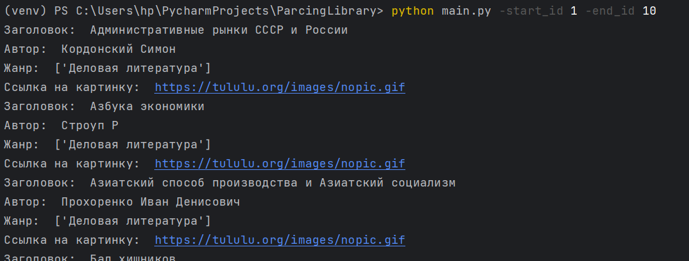

# ParsingLibrary
Парсинг онлайн-библиотеки [tululu](https://tululu.org/) и скачивание книг.

## Как установить
Python3 должен быть установлен. Далее загрузите ряд зависимостей с помощью pip (pip3):

    pip install -r requirements.txt

## Загрузка книг

### Агрументы

Скрипт принимает на вход 2 агрумента:

`start_id` - С какой страницы скачивать, целое число, по умолчанию 1.

`end_id` - До какой страницы скачивать, целое число, по умолчанию 0.

Если не введен параметр `start_id`, то скрипт скачает книги, начиная со страницы 1.
Если не введен параметр `end_id`, то скрипт скачает одну книгу со страницы `start_id`.

При запуске необходимо передать их:

    $ python main.py -start_id 1 -end_id 10

### Пример успешного запуска скрипта
При успешном запуске скрипта у вас должны появится папка *"books"* с текстовыми файлами книг и папка *"images"* с обложками книг.
На экран скрипт выводит информацию о скачиваемых книгах: название, автор, жанр, ссылка на обложку.

### Цель проекта

Код написан в образовательных целях на онлайн-курсе для веб-разработчиков [dvmn.org](https://dvmn.org/).
